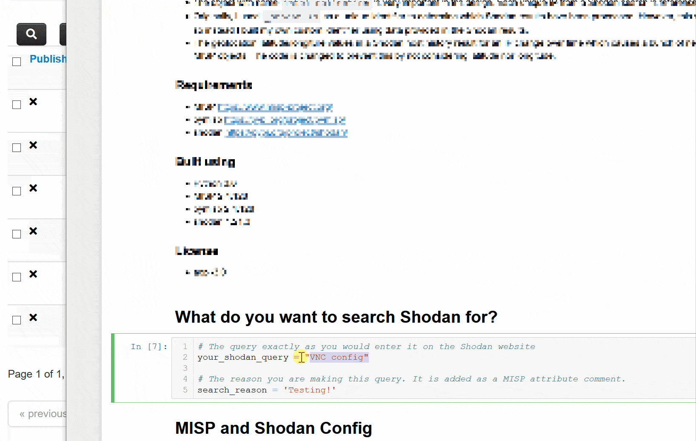

# Introduction
This project is built to prototype an automation and intelligence collection use case. The use case is the ability  to populate [MISP](https://www.misp-project.org/) with the results from the [Shodan search](https://developer.shodan.io/api) and the follow on [Shodan host](https://developer.shodan.io/api) API. The objects stored in MISP must be unique, it needs to visually graph well, and overall, it must be useful to an analyst. 

This is different than other projects that simply load Shodan results into MISP. This code attempts to organize queries into certain MISP events and reduce, as much as possible, duplication of results when the Shodan host command is ran.

The end of this notebook contains example MISP searches.

### Quick start
Provide a Shodan search query, just like you would on the Shodan website, and it will conduct a Shodan search. Watch the debug output to see the code progress and go into MISP to see the event as it builds.

### How it works
You provide a Shodan search query. From the results, the IP address is extracted. For this IP address, the Shodan host API is called with the history parameter. All results for the same IP address are saved into the same MISP event. Shodan results are extracted to individual objects. For example, the Shodan HTTP module results are extracted into the `http-metadata` object. As the results are processed, if values match what is already in MISP for a specific object, then it is NOT added (i.e. only unique values are added). Logging is used throughout so you can watch the code as it progresses through each step. Change the logging to debug to see everything.

There are several custom MISP objects used in this proof-of-concept. Normally, a object template is created to support the custom object. Instead, I did not do that and suppressed the MISP warnings. For each object template that already existed, it is likely no longer matching the template due to the needs of this prototype. In the below, I list the objects and if they are custom and/or modified.

* shodan-report - Modified version of https://www.misp-project.org/objects.html#_shodan_report
* intel-collection - Custom
* http-metadata  - Custom
* domain-ip  https://www.misp-project.org/objects.html#_domain_ip
* x509 - https://www.misp-project.org/objects.html#_x509
* geolocation -  https://www.misp-project.org/objects.html#_geolocation
* ftp-meta - Custom
 

### Notes
* The object with name `intel-collection` is very important in ths design. Each unique IP from a Shodan search is referenced to this object as a trigger.
* Originally, I used `_shodan.id` as a unique identifier to determine which Shodan results have been processed. However, this value is not always present so instead I built my own custom identifier using data provided in the Shodan results.
* The geolocation latitude/longitude values in a Shodan host history result for an IP change over time which causes a bunch of nearly identical geolocation MISP objects. The code is changed to prevent this by not considering latitude nor longitude.
* I was never able to get the pymisp complex_query to work correcly otherwise, some of this code would be simpllier. This is an example at the bottom on how to use it (or at least shows why it doesn't work).

### Requirements
* [MISP](https://www.misp-project.org/)
* [pymisp](https://pypi.org/project/pymisp/)
* [shodan](https://pypi.org/project/shodan/)

###  Built using 
* Python 3.6
* MISP 2.4.128 
* pymisp 2.4.128
* shodan 1.21.3

### License
* agpl-3.0
